

Serverless architecture

Before the hands-on lab setup guide

April 2021

Information in this document, including URL and other Internet Web site references, is subject to change without notice. Unless otherwise noted, the example companies, organizations, products, domain names, e-mail addresses, logos, people, places, and events depicted herein are fictitious, and no association with any real company, organization, product, domain name, e-mail address, logo, person, place or event is intended or should be inferred. Complying with all applicable copyright laws is the responsibility of the user. Without limiting the rights under copyright, no part of this document may be reproduced, stored in or introduced into a retrieval system, or transmitted in any form or by any means (electronic, mechanical, photocopying, recording, or otherwise), or for any purpose, without the express written permission of Microsoft Corporation.

Microsoft may have patents, patent applications, trademarks, copyrights, or other intellectual property rights covering subject matter in this document. Except as expressly provided in any written license agreement from Microsoft, the furnishing of this document does not give you any license to these patents, trademarks, copyrights, or other intellectual property.

The names of manufacturers, products, or URLs are provided for informational purposes only and Microsoft makes no representations and warranties, either expressed, implied, or statutory, regarding these manufacturers or the use of the products with any Microsoft technologies. The inclusion of a manufacturer or product does not imply endorsement of Microsoft of the manufacturer or product. Links may be provided to third party sites. Such sites are not under the control of Microsoft and Microsoft is not responsible for the contents of any linked site or any link contained in a linked site, or any changes or updates to such sites. Microsoft is not responsible for webcasting or any other form of transmission received from any linked site. Microsoft is providing these links to you only as a convenience, and the inclusion of any link does not imply endorsement of Microsoft of the site or the products contained therein.

© 2021 Microsoft Corporation. All rights reserved.

**Contents**

- [Serverless architecture before the hands-on lab setup guide](#serverless-architecture-before-the-hands-on-lab-setup-guide)
  - [Requirements](#requirements)
  - [Before the hands-on lab](#before-the-hands-on-lab)
    - [Task 1: Create a resource group](#task-1-create-a-resource-group)
    - [Task 2: Run ARM template to provision lab resources](#task-2-run-arm-template-to-provision-lab-resources)
    - [Task 3: Configure application settings on the ToolBoothFunctions Function App](#task-3-configure-application-settings-on-the-toolboothfunctions-function-app)
    - [Task 4: Add your IP address to the Cosmos DB firewall](#task-4-add-your-ip-address-to-the-cosmos-db-firewall)
    - [Task 5: Create a GitHub account](#task-5-create-a-github-account)

# Serverless architecture before the hands-on lab setup guide

## Requirements

- Microsoft Azure subscription (non-Microsoft subscription)
- Office 365 account. If required, you can sign up for an Office 365 trial at:
  - <https://portal.office.com/Signup/MainSignup15.aspx?Dap=False&QuoteId=79a957e9-ad59-4d82-b787-a46955934171&ali=1>
- GitHub account. You can create a free account at <https://github.com>.

## Before the hands-on lab

**Duration**: 15 minutes

In this exercise, you set up your environment for use in the rest of the hands-on lab. You should follow all steps provided _before_ attending the hands-on lab.

> **Important**: Many Azure resources require globally unique names. Throughout these steps, the word "SUFFIX" appears as part of resource names. You should replace this with your Microsoft alias, initials, or another value to ensure uniquely named resources.

### Task 1: Create a resource group

1. In the [Azure portal](https://portal.azure.com), select **Resource groups** from the Azure services list.

   

2. On the Resource groups blade, select **+Add**.

   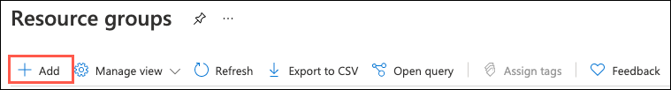

3. On the Create a resource group **Basics** tab, enter the following:

   - **Subscription**: Select the subscription you are using for this hands-on lab.
   - **Resource group**: Enter `hands-on-lab-SUFFIX` as the name of the new resource group.
   - **Region**: Select the region you are using for this hands-on lab.

   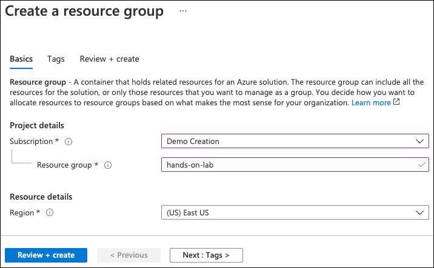

4. Select **Review + Create**.

5. On the **Review + create** tab, ensure the Validation passed message is displayed and then select **Create**.

### Task 2: Run ARM template to provision lab resources

In this task, you run an Azure Resource Manager (ARM) template to create the hands-on lab's resources. In addition to creating resources, the ARM template also executes a PowerShell script on the `LabVM` to install software and configure the server. The resources created by the ARM template include:

- Azure Data Lake Storage Gen2 account
  - Blob and File services
  - Containers named `images` and `export`
- Azure Cosmos DB
  - Database named `LicensePlates`
  - Containers named `Processed` and `NeedsManualReview`
- Virtual network with `default` subnet
- Virtual machine using the Visual Studio 2019 (Latest) Community Edition image
  - Uses custom script extension to
    - Install Microsoft Edge browser
    - Download starter solution from Serverless architecture MCW GitHub repo
    - Disable **IE Enhanced Security Configuration**
- Network security group for VM
- Network interface for VM
- Public IP address for VM
- Azure Function Apps
  - `TollBoothFunctions`
  - `TollBoothEvents`
- Application Insights
- Azure Computer Vision service
- Azure Event Grid Topic
- Azure Key Vault plus secrets for:
  - `computerVisionApiKey`
  - `cosmosDBAuthorizationKey`
  - `dataLakeConnectionString`
  - `eventGridTopicKey`

> **Note**: You can review the steps to manually provision and configure the lab resources in the [Manual resource setup guide](./Manual-resource-setup.md).

1. You are now ready to begin the ARM template deployment. To open a custom deployment screen in the Azure portal, select the Deploy to Azure button below:

   > **TODO**: Test ARM deployment one final time including the Logic App.
   > **TODO**: Globally find and replace `kylebunting` with `microsoft` in this project.

   

2. On the custom deployment screen in the Azure portal, enter the following:

   - **Subscription**: Select the subscription you are using for this hands-on lab.
   - **Resource group**: Select the hands-on-lab-SUFFIX resource group from the dropdown list.
   - **Vm Username**: Accept the default value, **demouser**.
   - **Vm Password**: Accept the default value, **Password.1!!**.

   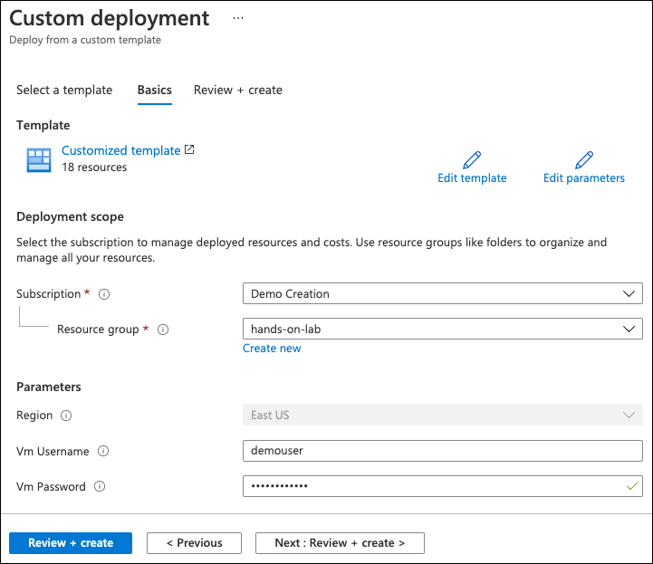

3. Select **Review + create** to review the custom deployment.

   > **Note**: The ARM template will append a hyphen followed by a 13-digit string at the end of resource names. This suffix ensures globally unique names for resources. We will ignore that string when referring to resources throughout the lab.

4. On the Review + create blade, ensure the _Validation passed_ message is displayed and then select **Create** to begin the custom deployment.

   > **Note**: The deployment of the custom ARM template should finish in about 5 minutes.

   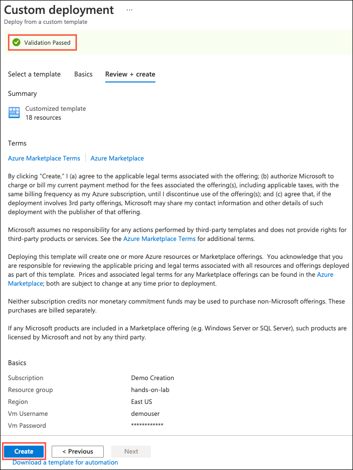

5. You can monitor the deployment's progress on the **Deployment** blade that opens when you start the ARM template deployment. When the deployment completes, select **Outputs** from the left-hand menu.

   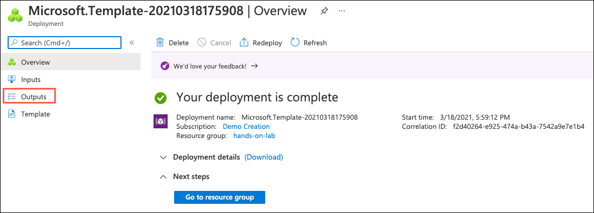

6. The deployment **Outputs** page contains the output values from running the deployment, including the endpoints for various services and the **Secret Uris** for the secrets added to Key Vault. Leave this page open for the next task, as you will be copying the **Secret Uri** values into the configuration for one of the Azure Function Apps.

   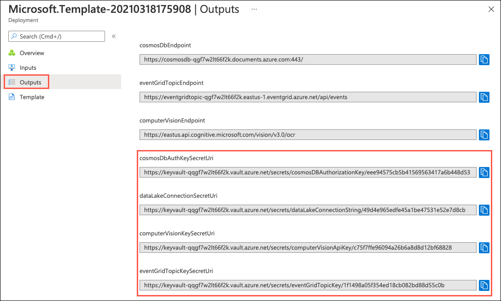

### Task 3: Configure application settings on the ToolBoothFunctions Function App

In this task, you copy the Secret Uri values from the ARM template deployment's output page and use them to populate the application settings in the Function App configuration.

1. In a new browser tab or window, open the [Azure portal](https://portal.azure.com) and navigate to the **hands-on-lab-SUFFIX** resource group you created above.

   > You can get to the resource group by selecting **Resource groups** under **Azure services** on the Azure portal home page and then select the resource group from the list. If there are many resource groups in your Azure account, you can filter the list for **hands-on-lab** to reduce the resource groups listed.

2. On your resource group blade, select the **TollBoothFunctions** Function App resource in the list of services available in the resource group.

   > **Note**: You will notice that most of the resource names have a hyphen followed by a 13-digit string at the end of their names. The ARM template added this suffix to ensure globally unique names for resources. We will ignore that string when referring to resources throughout the lab.

   

3. On the **TollBoothFunctions** Function App blade, select **Configuration** under Settings in the left-hand menu.

   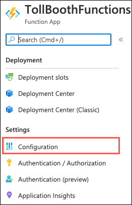

4. Using the **Secret Uri** values from the deployment outputs page you opened at the end of the previous task, update the application settings values for the function app. Use the table below for the name-value pairs to use when editing the secrets. You only need to update the `{xxxSecretUri}` token with the **Value** field for each secret and leave the other fields at their default values.

   |                          |                         |
   | ------------------------ | ----------------------- |
   | **App Setting Name**    | **Update Instructions** |
   | computerVisionApiKey     | Replace `{computerVisionApiKeySecretUri}` with the `computerVisionKeySecretUri` value from the outputs page. |
   | cosmosDBAuthorizationKey | Replace `{cosmosDbAuthKeySecretUri}` with the `cosmosDbAuthKeySecretUri` value from the outputs page. |
   | dataLakeConnection       | Replace `{dataLakeConnectionSecretUri}` with the `dataLakeConnectionSecretUri` value from the outputs page. |
   | eventGridTopicKey        | Replace `{eventGridTopicKeySecretUri}` with the `eventGridTopicKeySecretUri` value from the outputs page. |

   > Each of the settings above uses Key Vault references and has a value of `@Microsoft.KeyVault(SecretUri={TOKENIZED_STRING})`, where `{TOKENIZED_STRING}` is the placeholder for the secret URI for the associated Key Vault secret. The `@Microsoft.KeyVault(SecretUri=)` component of the value allows the Function App to read the value of the secret from Key Vault. Read the [Use Key Vault references for App Service and Azure Functions](https://docs.microsoft.com/azure/app-service/app-service-key-vault-references) document to learn more.

5. To update the values, you select each one on the **Application settings** tab of the configuration blade and then edit the setting's value. Start by choosing the `computerVisionApiKey` setting in the list of application settings.

   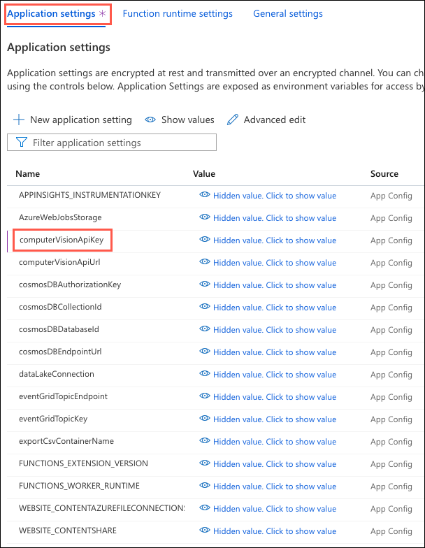

6. On the Add/Edit application setting dialog for the `computerVisionApiKey` setting, replace the `{computerVisionApiKeySecretUri}` token with the `computerVisionKeySecretUri` value from the deployment output page. **Be sure to remove the curly braces (`{}`) around the tokenized value**.

   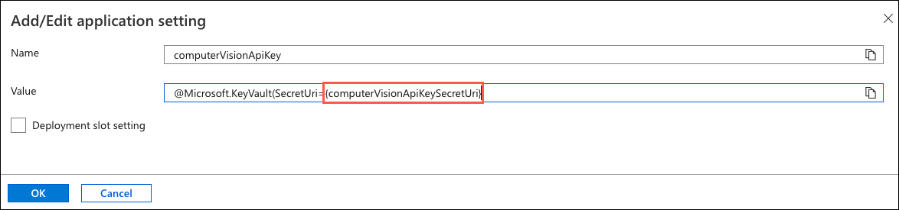

7. When you are finished updating the `computerVisionApiKey` setting, the final value should look similar to the following:

   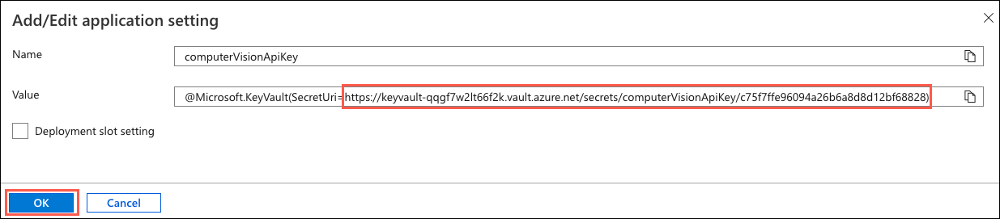

8. Select **OK** in the Add/Edit application settings dialog.

9. Repeat steps 5 through 8 for the remaining settings listed in the table above, updating the value of each to insert the secret Uri value from the deployment output page into the Key Vault reference string.

10. When all of the values have been updated, your settings should look similar to the following:

    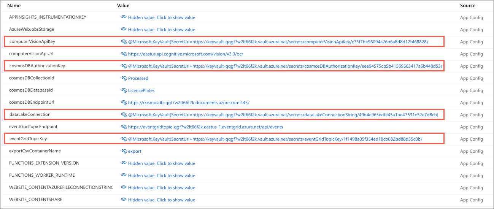

11. Select **Save** on the Configuration blade's toolbar to save the updated application settings.

    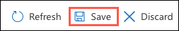

12. Select **Continue** on the Save changes prompt dialog.

    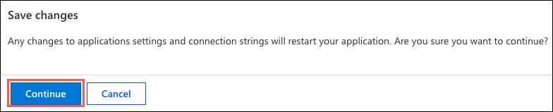

13. After saving, you should see the **Source** for each of the updated settings change to **Key Vault Reference** with a green checkmark, which indicates the Function App is successfully reading the secret value from Key Vault.

    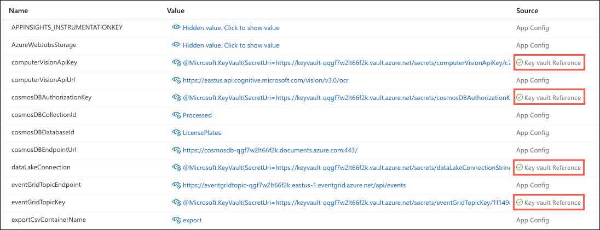

### Task 4: Add your IP address to the Cosmos DB firewall

1. In the [Azure portal](https://portal.azure.com), navigate to the **hands-on-lab-SUFFIX** resource group you created above.

   > You can get to the resource group by selecting **Resource groups** under **Azure services** on the Azure portal home page and then select the resource group from the list. If there are many resource groups in your Azure account, you can filter the list for **hands-on-lab** to reduce the resource groups listed.

2. On your resource group blade, select the **cosmosdb** Azure Cosmos DB account resource in the resource group's list of services available.

   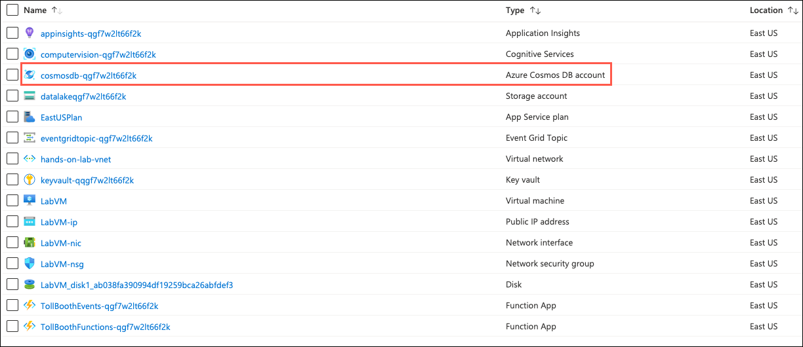

3. Next, select **Firewall and virtual networks** in the left-hand navigation menu of the Cosmos DB blade.

4. Select **+ Add my current IP** to add your IP address to the IP list under Firewall. Next, check the box next to **Accept connections from within public Azure datacenters**. Checking this box enables Azure services, such as your Function Apps, to access your Azure Cosmos DB account.

    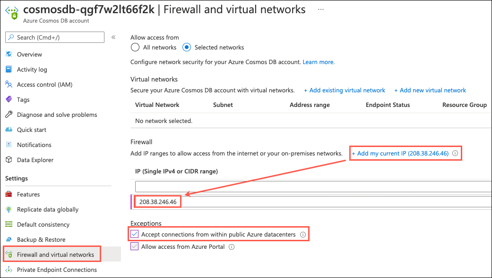

5. Select **Save**.

### Task 5: Create a GitHub account

In this task, you sign up for a free GitHub account, which is used for hosting a copy of the sample application used throughout this lab. This account will be integrated into the CI/CD workflow for pushing updates to the Function Apps in Azure.

> **Note**: If you already have a GitHub account and wish to use that account, you can skip this task.

1. Navigate to <https://github.com> in a web browser.

2. In the form on the page, enter a **username**, your **email** address, and a **password**, then select **Sign up for GitHub**.

    

3. On the Create your account screen, complete the account verification and select **Join a free plan**.

4. On the Welcome to GitHub screen, answer the questions and then select **Complete setup**.

5. Verify your email address by opening your email and selecting the **Verify email address** link in the email you receive from GitHub (noreply@github.com).

You should follow all steps provided _before_ performing the Hands-on lab.
